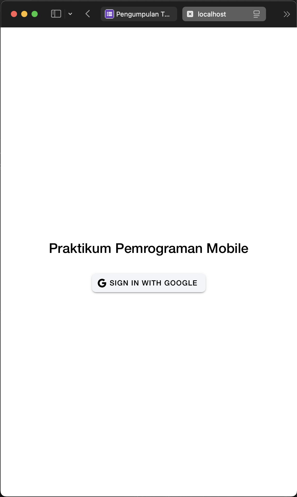
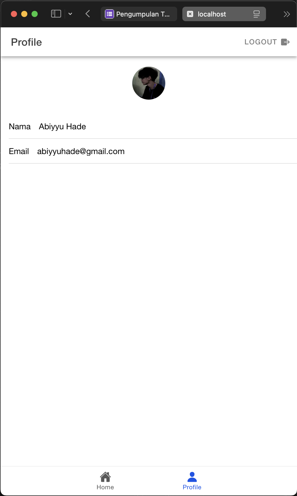

# Tugas 9 - Pertemuan 10
### Nama: Rizqullah Abiyyu Hade
### NIM: H1D022091
## Proses Login

Ketika pengguna menekan tombol "Sign In with Google" aplikasi akan memulai proses login menggunakan akun Google mereka. Di belakang layar, aplikasi meminta izin Google untuk mengakses profil pengguna. Setelah pengguna berhasil login, aplikasi mendapatkan informasi berupa token dari Google, yang kemudian digunakan untuk login ke Firebase. Firebase ini yang mengelola data autentikasi, sehingga aplikasi bisa tahu siapa yang baru saja login.

## Proses Pada Halaman Profil

Di halaman profil, aplikasi menampilkan nama, email, dan foto profil pengguna. Hal ini dilakukan dengan mengambil informasi yang sudah disimpan Firebase saat login tadi. Jadi, saat halaman profil terbuka, aplikasi mengambil nama dari user.displayName, email dari user.email, dan foto profil dari user.photoURL. Jika tidak ada foto profil, aplikasi bisa menampilkan gambar default yang sudah disiapkan.