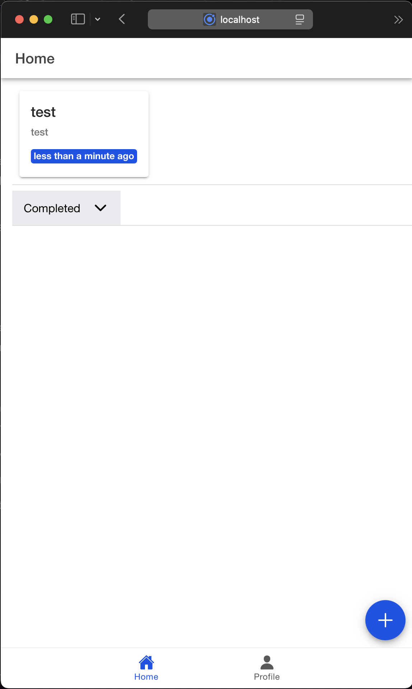
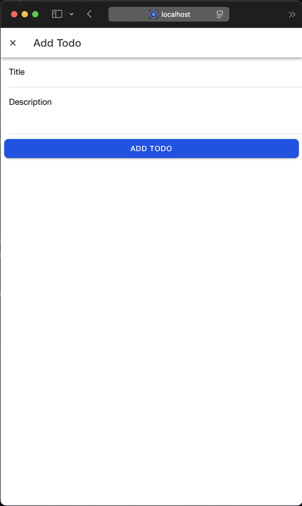
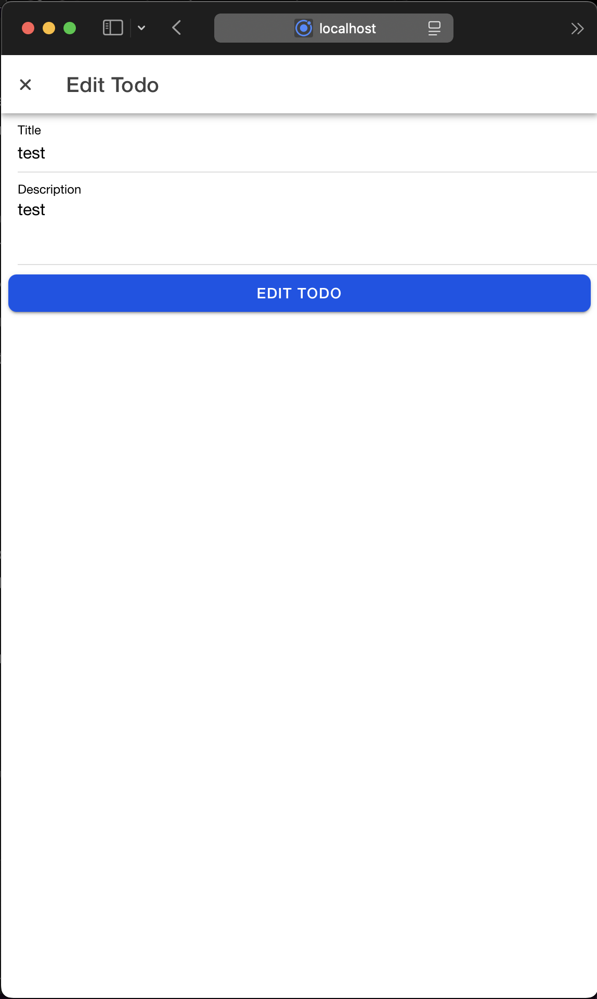
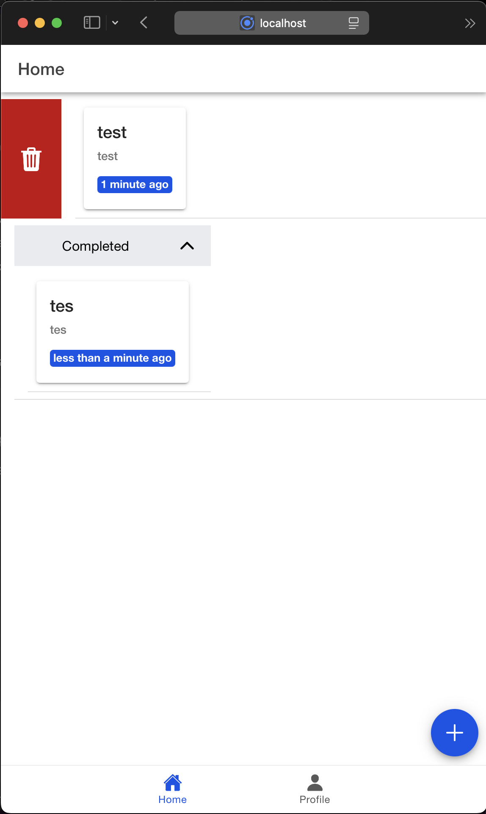
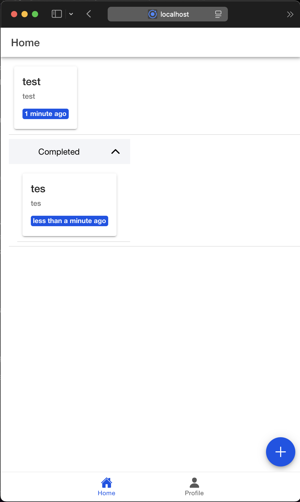
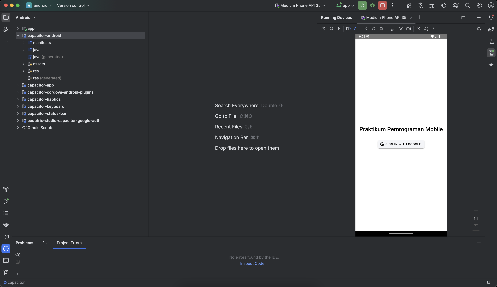

# Tugas 10 - Pertemuan 11
### Nama: Rizqullah Abiyyu Hade
### NIM: H1D022091

## Halaman Utama

    Halaman ini menampilkan daftar tugas yang sedang dikerjakan atau belum selesai. Setiap tugas disajikan dalam bentuk card atau daftar sederhana, memuat informasi seperti judul, deskripsi, dan tanggal terakhir diperbarui. Pengguna dapat berinteraksi dengan daftar tugas melalui beberapa cara:
    - Geser ke kanan: Menghapus tugas. Setelah tugas dihapus, tugas tersebut langsung hilang dari daftar.
    - Geser ke kiri: Menandai tugas sebagai selesai. Tugas yang ditandai selesai akan dipindahkan ke bagian khusus untuk tugas yang sudah diselesaikan.
    Jika tidak ada tugas yang aktif, akan muncul pesan "Belum ada tugas aktif" untuk memberitahu bahwa pengguna belum membuat tugas atau semua tugas telah selesai.

# Halaman Tambah Tugas

    Untuk menambahkan tugas baru, pengguna bisa membuka formulir yang muncul dalam bentuk popup modal. Formulir ini berisi beberapa elemen penting:
    - Judul Tugas: Kolom untuk mengisi nama atau topik utama dari tugas.
    - Deskripsi: Kolom untuk menambahkan keterangan atau detail dari tugas yang akan dibuat.
    - Tombol Simpan: Berfungsi untuk menambahkan tugas baru ke daftar tugas aktif.
    Setelah pengguna menekan tombol simpan, tugas baru secara otomatis masuk ke daftar utama dan langsung terlihat di halaman utama.

# Halaman Edit Tugas

    Jika ada tugas yang perlu diperbarui, pengguna dapat menggunakan fitur edit. Tampilan edit serupa dengan formulir tambah tugas, tetapi isinya sudah otomatis terisi dengan data tugas yang dipilih. Berikut adalah elemen utama pada formulir edit:
    - Judul Tugas: Berisi nama tugas yang bisa diubah sesuai kebutuhan.
    - Deskripsi: Menampilkan informasi detail tugas yang juga dapat diperbarui.
    - Tombol Simpan: Digunakan untuk menyimpan perubahan yang dilakukan pada tugas tersebut.
    Setelah perubahan disimpan, daftar tugas di halaman utama akan langsung diperbarui.

# Fitur Hapus Tugas

    Penghapusan tugas dapat dilakukan langsung dari halaman utama dengan cara menggeser tugas ke kanan. Setelah tindakan ini dilakukan, tugas akan langsung hilang dari daftar dan tidak akan muncul kembali. Selain itu, pengguna akan mendapatkan notifikasi bahwa tugas telah berhasil dihapus.

# Halaman Tugas Selesai

    Semua tugas yang telah selesai dipindahkan ke halaman atau bagian khusus yang bisa dibuka menggunakan accordion (bagian yang bisa diperluas). Setiap tugas yang selesai tetap memuat informasi seperti judul, deskripsi, dan tanggal terakhir diperbarui.
    Di bagian ini, pengguna masih bisa melakukan beberapa tindakan:
    - Pulihkan Tugas: Mengembalikan tugas ke daftar aktif agar dapat dikerjakan ulang.
    - Edit Tugas: Mengubah data tugas yang sudah selesai menggunakan fitur edit.
    - Hapus Tugas: Menghapus tugas secara permanen dari daftar tugas selesai.
    Tampilan ini memudahkan pengguna untuk mengelola tugas, baik yang sedang dikerjakan maupun yang sudah selesai.

# Build APK
Berikut adalah panduan untuk melakukan build APK dari aplikasi Ionic:
1. Menambahkan Platform Android

        ionic capacitor add android
2. Build Proyek Ionic

        ionic build
3. Sinkronisasi dengan Capacitor

        ionic cap sync android
4. Membuka Proyek di Android Studio
        
        ionic cap open android
5. Hasil Build APK
