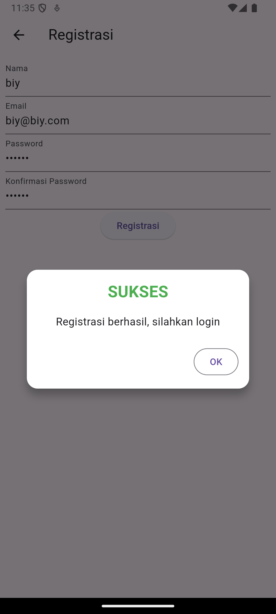
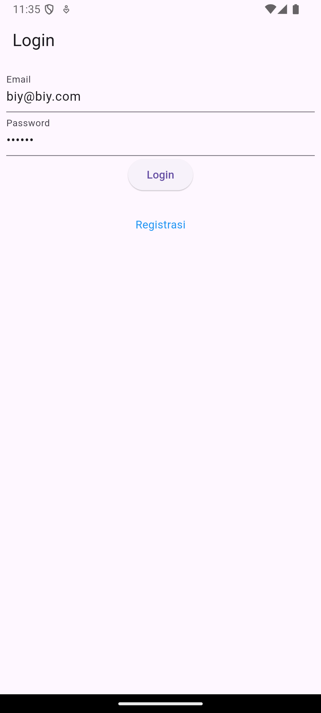
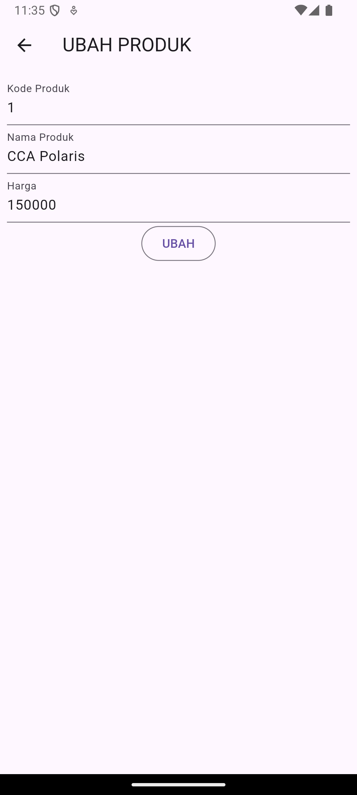

# Toko Kita

## Proses Register
### 1. Frontend - Flutter Model Registrasi: 

    Model Registrasi di Flutter digunakan untuk merepresentasikan data yang diterima dari API. Model ini memiliki tiga properti, yaitu code, status, dan data, yang diisi berdasarkan respons JSON dari API.

    Halaman Registrasi:
    Halaman ini berisi formulir untuk pengguna mengisi informasi registrasi. Ada empat field input yang harus diisi:
    - Nama: Minimal harus 3 karakter.
    - Email: Wajib diisi dan harus menggunakan format email yang valid.
    - Password: Minimal harus 6 karakter.
    - Konfirmasi Password: Harus cocok dengan field Password.

    Proses Registrasi:
    Setelah pengguna mengisi form dan menekan tombol "Registrasi", validasi form dilakukan. Jika ada input yang tidak valid, pesan kesalahan akan ditampilkan. Validasi menggunakan:
    - validator: (value)
    - if (value!.isEmpty) untuk memeriksa apakah field terisi.
    - if (!regex.hasMatch(value)) untuk memeriksa apakah format email sesuai dengan aturan regex.

    Mengirim Data:
    Jika semua field valid, method _submit() dipanggil. Data dari form (nama, email, dan password) dikirim ke RegistrasiBloc untuk diproses dan diteruskan ke API. Saat proses berlangsung, indikator loading diaktifkan dengan mengatur _isLoading menjadi true.

    Menangani Respons:
    Jika registrasi berhasil, dialog sukses akan muncul, memberi tahu pengguna bahwa registrasi berhasil dan mereka bisa login. Jika terjadi kesalahan (misalnya, email sudah digunakan), dialog peringatan akan ditampilkan.

    Mengatur Status Loading:
    Setelah pengiriman data selesai, indikator loading dinonaktifkan dengan mengatur _isLoading kembali menjadi false.
### 2. Backend - API (CodeIgniter) Model MRegistrasi:

    Model MRegistrasi digunakan untuk berinteraksi dengan tabel member dalam database, di mana hanya tiga kolom yang diperbolehkan untuk diisi, yaitu: nama, email, dan password.

    Pada RegistrasiController, method registrasi() bertugas menerima data yang dikirim melalui permintaan dari aplikasi Flutter. Data yang diterima mencakup nama, email, dan password (password di-hash menggunakan password_hash demi keamanan). Setelah data diolah, MRegistrasi dipakai untuk menyimpan informasi tersebut ke database. Jika penyimpanan berhasil, sistem mengembalikan respons dengan status 200 dan pesan "Registrasi Berhasil".
## Proses Login
### 1. Frontend - Flutter Model Login:
    Model Login di Flutter berfungsi untuk merepresentasikan data respons dari API saat proses login berlangsung. Model ini memiliki beberapa properti, yaitu code, status, token, userID, dan userEmail. Method fromJson() digunakan untuk mengonversi respons JSON menjadi objek Login.

    Halaman Login:
    Halaman ini digunakan untuk menerima input dari pengguna. Terdapat dua field input:
    1. Email: Divalidasi untuk memastikan tidak kosong.
    2. Password: Divalidasi untuk memastikan tidak kosong.
    
    Proses Login:
    Setelah pengguna mengisi form dan menekan tombol "Login", form akan divalidasi. Jika ada field yang tidak valid, pesan kesalahan akan muncul.

    Mengirim Data:
    Jika validasi berhasil, method _submit() dipanggil. Data dari form (email dan password) dikirim ke LoginBloc untuk diteruskan ke API. Saat proses berlangsung, indikator loading diaktifkan dengan mengubah nilai _isLoading menjadi true.

    Menangani Respons:
    Jika login berhasil (status code 200), token dan ID pengguna akan disimpan menggunakan UserInfo untuk menjaga sesi pengguna. Setelah login berhasil, pengguna diarahkan ke halaman ProdukPage. Jika login gagal, dialog peringatan akan muncul dengan pesan "Login gagal, silahkan coba lagi".

    Mengatur Status Loading:
    Setelah pengiriman data selesai, indikator loading dinonaktifkan dengan mengubah nilai _isLoading menjadi false.

    Bloc LoginBloc:
    Method login():
    - Mengambil URL API untuk login.
    - Mengirim permintaan POST ke API dengan body berisi email dan password.
    - Mengonversi respons JSON menjadi objek Login menggunakan method fromJson().
### 2. Backend - API (CodeIgniter) Model MLogin:
    Model MLogin digunakan untuk berinteraksi dengan tabel member_token di database. Kolom yang diizinkan untuk diisi adalah member_id dan auth_key.

    Controller LoginController:
    Dalam method login(), data email dan password diambil dari permintaan (request). Proses login dimulai dengan mencari pengguna berdasarkan email menggunakan model MMember. Jika email tidak ditemukan, respons akan diberikan dengan status 400 dan pesan "Email tidak ditemukan". Jika email ditemukan tetapi password tidak valid (diperiksa menggunakan password_verify), respons juga dikembalikan dengan status 400 disertai pesan "Password tidak valid".

    Jika login berhasil, token otentikasi (auth_key) akan dibuat menggunakan method RandomString(). Kemudian, member_id dan auth_key disimpan ke dalam tabel member_token. Terakhir, respons dikembalikan dengan informasi berupa token, ID, dan email pengguna.

## Proses Menampilkan Data pada Halaman Daftar Produk:
### 1. Permintaan Data ke Backend:
    Saat ProdukPage dibuka, FutureBuilder digunakan untuk mengambil data produk secara asinkron. Di dalam FutureBuilder, method ProdukBloc.getProduks() dipanggil untuk mengirim permintaan ke API yang telah ditentukan guna mendapatkan daftar produk. 
### 2. Mengambil Data dari API:
    Dalam ProdukBloc.getProduks(), URL API yang sesuai (misalnya ApiUrl.listProduk) digunakan untuk melakukan permintaan GET. Permintaan ini diterima oleh API backend, yang di-handle oleh ProdukController, dan akan memanggil method list().
### 3. Pengolahan di Backend:
    Method list() di ProdukController bertugas mengambil semua data produk dari database melalui model MProduk. Data produk diambil menggunakan method findAll() dan kemudian dikirimkan kembali ke frontend sebagai respons JSON, yang mencakup status dan data produk.
### 4. Parsing Respons JSON:
    Setelah API mengembalikan respons, data JSON yang diterima di ProdukBloc diparsing menjadi objek Dart. Data JSON ini kemudian di-decode dan dipetakan menjadi daftar objek Produk menggunakan method Produk.fromJson().
### 5. Menampilkan Data di UI:
    Pada ProdukPage, FutureBuilder memantau status permintaan data. Jika data berhasil diambil (ditandai dengan snapshot.hasData), widget ListProduk akan dibangun. ListProduk bertanggung jawab untuk menampilkan daftar produk, menggunakan ListView.builder() untuk membuat item produk secara dinamis berdasarkan jumlah produk dalam daftar.
### 6. Membuat Item Produk:
    Untuk setiap item dalam daftar produk, widget ItemProduk dibuat, yang menampilkan nama produk dan harga. Setiap ItemProduk dilengkapi dengan GestureDetector, sehingga ketika pengguna mengetuk item tersebut, navigasi akan diarahkan ke halaman detail produk (ProdukDetail).

## Proses Tambah Produk
### 1. Membuka Halaman Form:
    Ketika pengguna menekan tombol "Tambah Produk", aplikasi akan mengarahkan ke halaman ProdukForm. Pada halaman ini, judul form ditampilkan sebagai "TAMBAH PRODUK" dan tombol aksi diatur untuk "SIMPAN".
### 2. Mengisi Form:
    Pengguna kemudian akan mengisi informasi produk seperti Kode Produk, Nama Produk, dan Harga. Setiap field dilengkapi dengan validator untuk memastikan bahwa input tidak kosong sebelum dapat disimpan.
### 3. Menangani Pengiriman Data:
    Setelah pengguna menekan tombol "SIMPAN", validasi form dilakukan. Jika semua input valid, fungsi simpan() dipanggil. Selama proses ini, status loading diaktifkan agar tidak ada interaksi tambahan hingga proses selesai.
### 4, Membuat Objek Produk:
    Sebuah objek Produk baru dibuat menggunakan data yang diisi dalam form. Nilai-nilai yang diinput oleh pengguna diambil dari TextEditingController dan diassign ke properti-properti dari objek produk tersebut.
### 5. Mengirim Data ke Backend:
    Method ProdukBloc.addProduk() kemudian dipanggil dengan objek produk sebagai argumen. Fungsi ini mengirimkan permintaan POST ke API untuk menyimpan produk baru ke dalam database.
### 6. Menangani Respons:
    Setelah permintaan berhasil, pengguna akan diarahkan kembali ke halaman ProdukPage. Jika terjadi kesalahan selama proses, dialog peringatan akan muncul untuk memberi tahu pengguna tentang masalah yang terjadi.

## Proses Ubah Produk
### 1. Membuka Halaman Form untuk Ubah Produk:
    Ketika pengguna memilih untuk mengedit produk yang ada, aplikasi akan menavigasi ke halaman ProdukForm. Pada halaman ini, judul form diubah menjadi "UBAH PRODUK", dan tombol aksi juga diubah menjadi "UBAH". Data produk yang akan diubah dimasukkan ke dalam form menggunakan TextEditingController.
### 2. Mengisi Form:
    Pengguna dapat mengubah detail produk seperti Kode Produk, Nama Produk, dan Harga melalui form yang tersedia.
### 3. Menangani Pengiriman Data:
    Setelah pengguna menekan tombol "UBAH", validasi form dilakukan. Jika semua input valid, fungsi ubah() akan dipanggil. Proses ini juga mengaktifkan status loading untuk mencegah interaksi lebih lanjut hingga proses selesai.
### 4. Membuat Objek Produk untuk Ubah:
    Objek Produk baru dibuat menggunakan ID produk yang ada, lalu memperbarui nilai-nilai berdasarkan perubahan yang diinput oleh pengguna melalui form.
### 5. Mengirim Data ke Backend:
    Metode ProdukBloc.updateProduk() dipanggil dengan objek produk yang telah diperbarui sebagai argumen. Fungsi ini mengirimkan permintaan PUT ke API untuk memperbarui data produk di database.
### 6. Menangani Respons:
    Setelah permintaan berhasil, pengguna akan diarahkan kembali ke halaman ProdukPage. Jika ada kesalahan selama proses, dialog peringatan akan muncul untuk memberi tahu pengguna tentang masalah tersebut.

## Halaman Register 

## Pop Up Notif Berhasil

## Halaman Login

## Halaman Tambah Produk

## Halaman List Produk

## Halaman Detail Produk

## Halaman Ubah Produk
