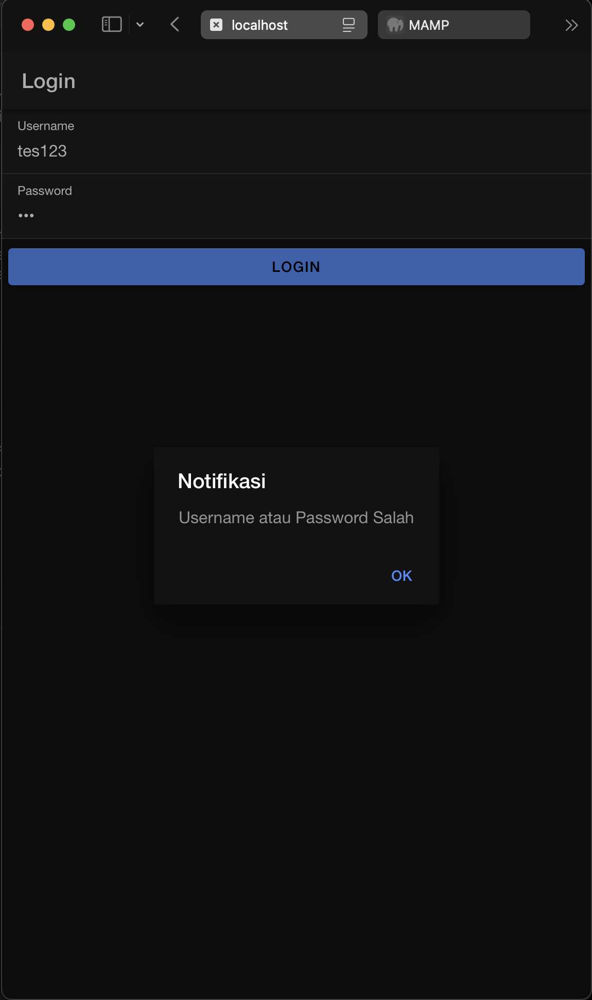

# Tugas Pertemuan 8 

### Nama: Rizqullah Abiyyu Hade
### NIM : H1D022091

## Cara Kerja Login
### 1. Input Data Login
    Pengguna memasukkan username dan password pada halaman login dan menekan tombol "Login".
### 2. Kirim Data ke API
    Aplikasi mengambil data input username dan password, lalu mengirimnya ke server menggunakan API login.php.
### 3. Verifikasi di Server
    Server menerima permintaan login dan memeriksa apakah ada data pengguna di database yang sesuai dengan username dan password yang dikirim. Jika ditemukan kecocokan, server mengembalikan respons dengan data username, token unik, dan status login berhasil.
### 4. Berhasil Login 
    Jika login berhasil, aplikasi menggunakan AuthenticationService untuk menyimpan token dan username di Preferences (penyimpanan lokal). Status autentikasi diperbarui ke true, dan pengguna diarahkan ke halaman home.
### 5. Gagal Login
    Jika data tidak cocok atau ada kesalahan, server mengirimkan status login gagal, dan aplikasi menampilkan pesan kesalahan kepada pengguna.

# Screenshot
## Mengisikan Form Login 

## Jika Username dan Password Benar

## Jika Username dan Password Salah
