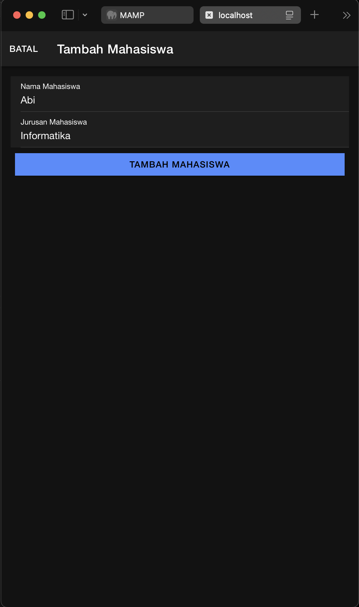
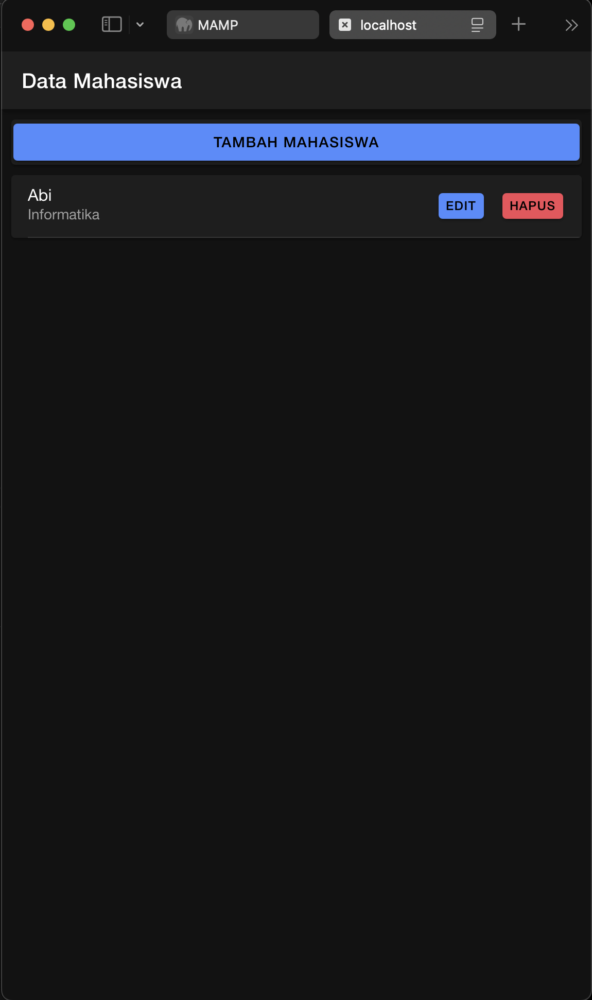
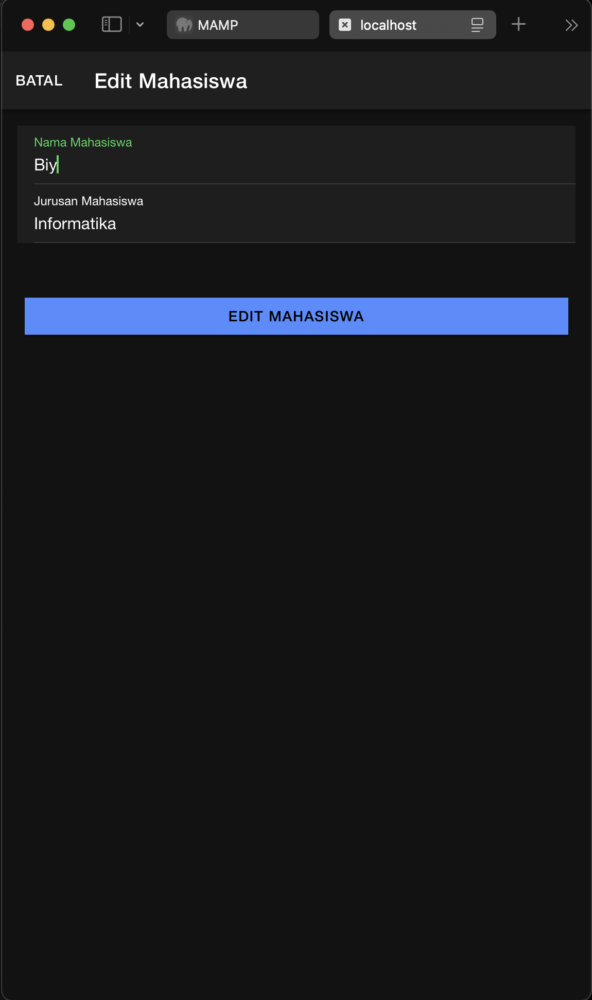
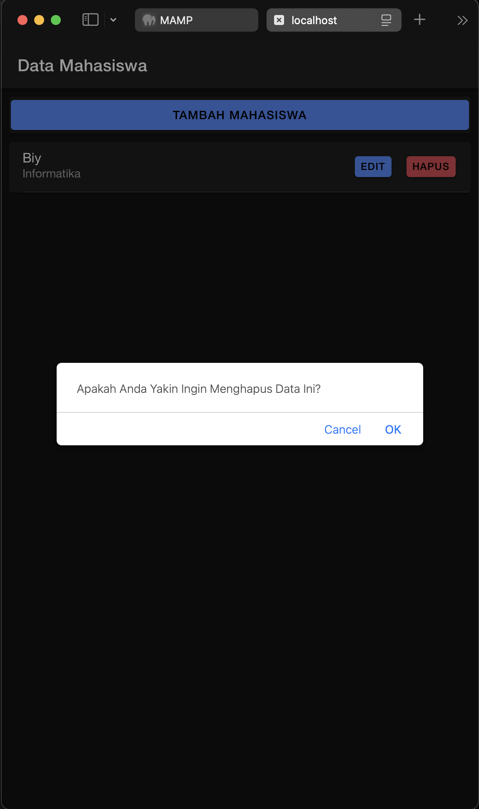

# Tugas Pertemuan 9 

### Nama: Rizqullah Abiyyu Hade
### NIM : H1D022091

## Create 

    
    Fungsi yang Digunakan: tambahMahasiswa()
    Fungsi ini mengecek terlebih dahulu apakah kedua input (nama dan jurusan) tidak kosong. Jika keduanya sudah terisi, maka data (nama dan jurusan) dibungkus dalam sebuah objek data. Menggunakan ApiService, data ini dikirim ke API endpoint tambah.php dengan metode POST. Jika permintaan berhasil, modal ditutup, data di-reset, dan fungsi getMahasiswa() dipanggil untuk memperbarui daftar mahasiswa. Jika ada kesalahan, pesan error dicetak di konsol.

## Read

    Fungsi yang Digunakan: getMahasiswa()
    Fungsi ini mengirim permintaan GET ke API endpoint tampil.php untuk mendapatkan semua data mahasiswa. Jika berhasil, respons dari server disimpan di variabel dataMahasiswa, yang kemudian bisa digunakan untuk menampilkan daftar mahasiswa di tampilan. Jika terjadi kesalahan, pesan error dicetak di konsol.

## Update

    Fungsi yang Digunakan: editMahasiswa()
    Sebelum mengedit data, pengguna membuka modal edit dengan memanggil fungsi openModalEdit dan mengisi data mahasiswa yang ada. Setelah data baru diisi, objek data dibentuk dengan properti id, nama, dan jurusan. Data ini kemudian dikirim ke API endpoint edit.php menggunakan metode POST atau PUT. Jika permintaan berhasil, modal ditutup, data di-reset, dan getMahasiswa() dipanggil untuk memperbarui daftar mahasiswa yang telah diubah. Jika ada kesalahan, pesan error dicetak di konsol.

## Delete

    Fungsi yang Digunakan: hapusMahasiswa()
    Fungsi ini dimulai dengan menampilkan konfirmasi penghapusan menggunakan window.confirm untuk memastikan bahwa pengguna benar-benar ingin menghapus data. Jika pengguna mengonfirmasi, fungsi ini akan memanggil API endpoint hapus.php dengan mengirimkan id dari mahasiswa yang ingin dihapus. Jika penghapusan berhasil, getMahasiswa() dipanggil kembali untuk memperbarui daftar mahasiswa. Jika terjadi kesalahan, pesan error dicetak di konsol.