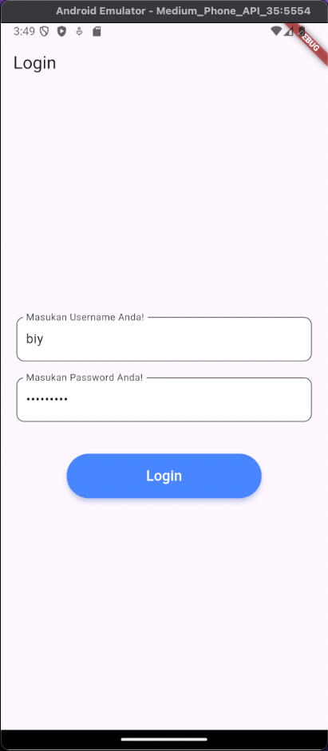
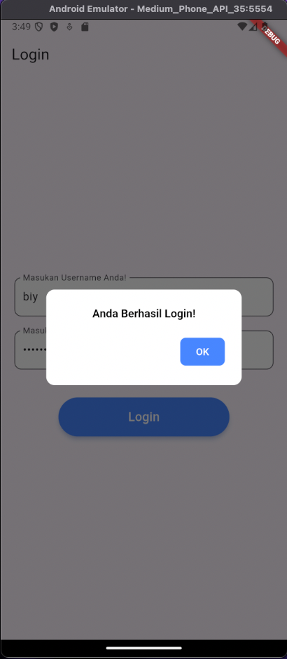
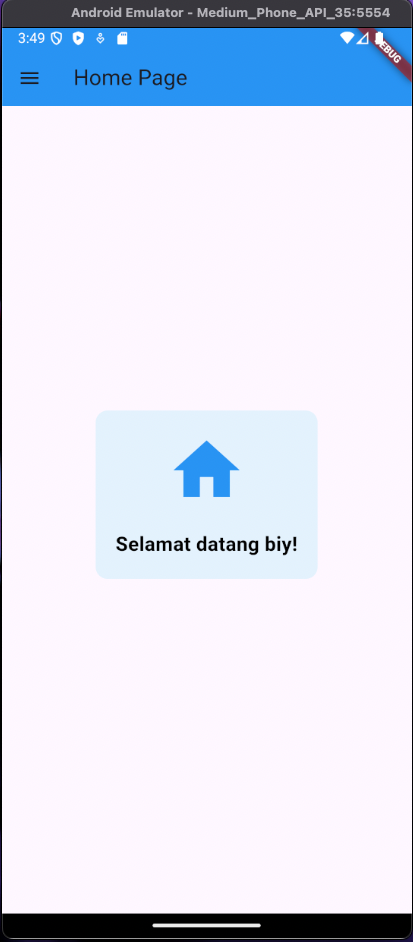
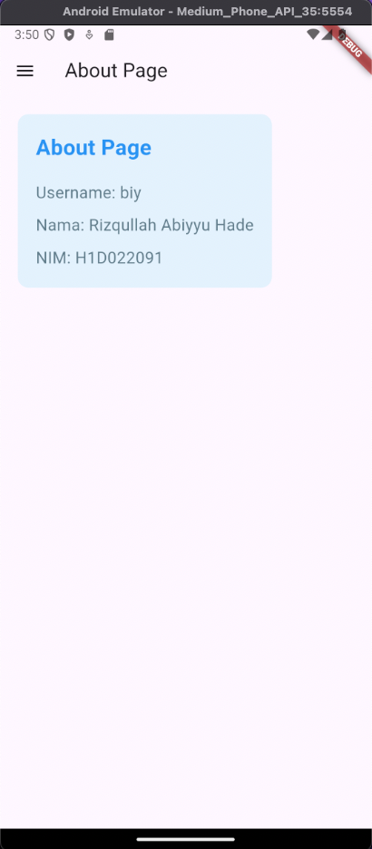

# Tugas Pertemuan 3

## Nama, NIM, Shift
Nama: Rizqullah Abiyyu Hade

NIM: H1D022091

Shift Baru: A

Shift Awal: A

## Penjelasan Code
- Import untuk mengimpor Material dan SharedPreferences.
- TextEditingController untuk mengelola inputan dari user.
- _saveUsername untuk menyimpan username ke SharedPreferences.
- _showInput untuk menghasilkan TextField dengan konfigurasi yang sudah ditentukan.
- _showDialog untuk menampilkan dialog atau alert yang sesuai dan untuk melakukan navigasi.
- _loadUsername untuk mengambil username dari SharedPreferences dan untuk memperbarui state.
- initState untuk memanggil state _loadUsername.
- DrawerHeader untuk menampilkan header pada side menu.
- ListTile untuk menyediakan opsi ke halaman home dan about.

## Screenshot 
### Halaman Login

### Alert

### Halaman Home

### About
